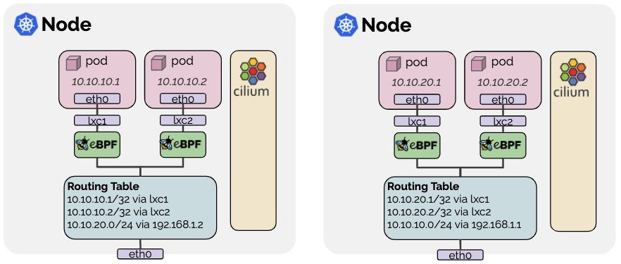

# Установка cilium

## Подготовка k3s

Для установки cilium в k3 нужно установить мастер ноды с отключенным cni по умолчанию (flannel).
При установки добавить в INSTALL_K3S_EXEC опции --flannel-backend=none --disable-network-policy)

Пример установки из [скрипта](./../../script/add-master.sh)
```bash
INSTALL_K3S_EXEC="--disable traefik --disable servicelb --flannel-backend=none --disable-network-policy" MASTER_NODE_NAME=k3s-master ./add-master.sh
```

## Установка cilium CLI (рекомендуемый способ)

Примеры установки из [скрипта](install-cli.sh)

```shell
# фиксированная версия под linux на x86
DISTR_URL=https://github.com/cilium/cilium-cli/releases/download/v0.18.3/ ./install-cli.sh
# или
CILIUM_CLI_VERSION=v0.18.3 ./install-cli.sh
# последняя версия под arm
GOARCH=arm64 ./install-cli.sh
```

Для запуска нужно иметь настроенный kubectl. Проверка работы после установки

```shell
    cilium status
    # если установить и запускать изнутри lxc и не настроен kubectl то можно --kubeconfig
    cilium status --kubeconfig /etc/rancher/k3s/k3s.yaml
```

## Установки Cilium (native routing)

В lxc контейнерах cilium будет эффективно работать в режиме [native rouniting](https://docs.cilium.io/en/v1.17/network/concepts/routing/#native-routing),
т.к. все ноды кластера k3s находятся в L2 сети




### Параметры конфигурации

    - routing-mode: native ( Включить режим native routing )
    - auto-direct-node-routes: true (чтобы каждый нод кластера k3s знал обо всех IP-адресах подов всех других узлов)
    - ipv4-native-routing-cidr: {CIDR сети lxc связывающей контейнеры нод k3s}    
    - ipam.operator.clusterPoolIPv4PodCIDRList: {CIDR сети подов кластера, не пересекающуюся с CIDR сети lxc}
    - enable-endpoint-routes: true (Включает прямую маршрутизацию к парам veth ENI без необходимости маршрутизации через интерфейс cilium_hostб
    что уменьшает задержку и накладные расходы на обход cilium_host и NAT в eBPF-only режиме )
    - hubble.relay.enabled: true (Централизует сбор событий со всех нод кластера)

```shell
cilium install \
  --version 1.17.4 \
  --set routingMode=native \
  --set ipv4NativeRoutingCIDR=$(lxc network show lxdbr0 | grep '^  ipv4.address:' | awk '{print $2}') \
  --set kubeProxyReplacement=true \
  --set ipam.operator.clusterPoolIPv4PodCIDRList="10.111.0.0/16" \
  --set autoDirectNodeRoutes=true \
  --set endpointRoutes.enabled=true \
  --set hubble.relay.enabled=true

```